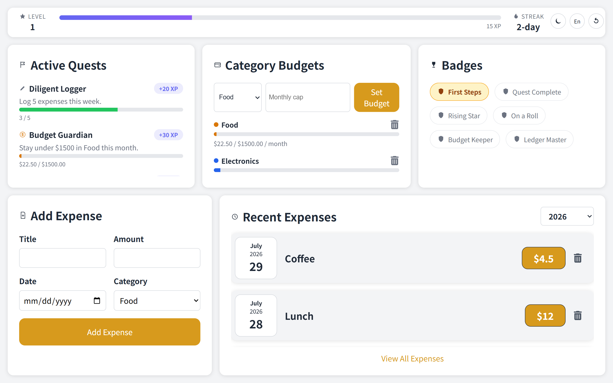

# Expense Tracker

A gamified expense tracker: log and filter everyday expenses while earning XP, leveling up, keeping a daily streak, completing budget quests, and unlocking badges along the way.

1. Expense Logging: Allows users to input their expenses quickly and easily.

2. Expense Filtering: filtering by year for better organization.

3. Gamification: earn XP, level up, maintain a daily streak, complete quests, and unlock badges as you track spending.

4. Category Budgets: set a monthly cap per category and track spend against it with a progress bar.
